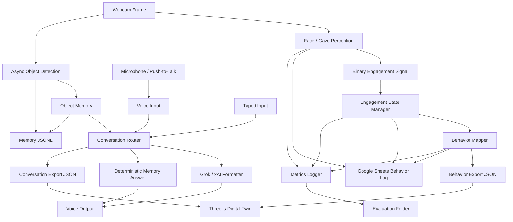

# System Design

## Problem being solved

LeLampCV is not a face detector bolted onto a demo UI. It is a **perception-to-action pipeline** for an expressive lamp agent. The software has to:

1. Decide whether the user is **engaged** with the lamp/camera in a way that matters for interaction—not merely “facing forward.”
2. React through **behavior commands** (pose + light + rationale) that could drive real hardware later.
3. **Observe** objects in the desk scene under practical frame rates.
4. **Store** object sightings in durable memory for recall.
5. **Answer questions** using that memory when the user asks where something was seen.
6. **Surface the same command stream** to a digital twin and to external logs so behavior is inspectable, not invisible.

If any step lies about what it knows (especially location), the whole system fails the user in a way that is hard to debug. The design prioritizes **traceable decisions** over opaque “smart” responses.

## System architecture diagram

*(Same diagram lives in `assets/diagrams/system_architecture.mmd` for export to PNG/SVG.)*

## Subsystems (what each block owns)

**Face / gaze perception** (`perception.py`)  
Runs every frame on the webcam RGB frame. Produces a structured result: face present or not, head reasonably forward, iris-derived gaze proxies, and a smoothed boolean `looking_at_camera`. No lamp logic lives here.

**Binary engagement signal**  
Derived from smoothed gaze (and related gates). This is the input to the FSM. Metrics record a **debounced** copy of this binary label so trials align with what the state machine actually sees after timers.

**Engagement state manager** (`state_manager.py`)  
Turns noisy gaze into a small state machine: baseline ENGAGED/DISENGAGED, timed transitions into ATTENTION_SEEKING, COOLDOWN, and an externally forced ANSWERING window while the app speaks. Variants (which attention animation) are chosen here.

**Behavior mapper** (`behavior.py`)  
Pure mapping: FSM state (+ optional variant) → `LampBehaviorCommand`. Numbers are meant to be servo/light targets later; strings document intent for logs.

**Async object detection** (`async_object_perception.py` + `object_perception.py`)  
Samples frames on an interval and runs YOLO on a worker thread. Results feed memory only; they do not block the gaze loop.

**Object memory** (`memory.py`)  
Append-only JSONL at `runtime/memory/object_memory.jsonl`. Dedup avoids flooding identical sightings.

**Conversation router** (`conversation.py`)  
Normalizes and classifies text/voice questions. Memory-location phrasing is handled **before** general chat. Evidence strings are built from JSONL rows; Grok may rephrase but does not define facts.

**Grok / xAI formatter** (`grok_client.py`)  
Two paths: memory-grounded polish (must respect evidence) and general Q&A (no obligation to use object memory).

**Voice output** (`voice_output.py`)  
Non-blocking TTS so the main loop keeps sampling the camera.

**Exports**  
`behavior_exporter.py` → `simulator/latest_behavior.json`.  
`conversation_exporter.py` → `simulator/latest_conversation.json`.

**Google Sheets logger** (`google_sheets_logger.py`)  
Background queue enqueues one row per logging interval with perception fields + behavior command. Never drives the twin.

**Metrics logger** (`metrics.py`)  
Writes latency samples and optional engagement trials under `runtime/metrics/` during runs; `evaluation/` holds a frozen copy for submission.

## Runtime data contracts

These are the structures that actually cross module boundaries.

### `FacePerceptionResult`

| Field | Role |
|-------|------|
| `face_detected` | Landmarker found a face. |
| `head_forward` | Head pose gate (not staring sideways). |
| `eye_contact` | Iris-based gate for “eyes aligned with camera proxy.” |
| `looking_at_camera` | Temporally smoothed engagement primitive fed to the FSM. |
| `gaze_direction` | Coarse direction label for debug/visualization. |
| `calibration_text` | Human-readable calibration state (`not calibrated`, `calibrating …`, `calibrated`). |
| `debug_text` | Pipe-separated diagnostics for the overlay and Sheets. |

*(Implementation also carries `calibrated`, `raw_result` for internal use.)*

### Engagement semantics (two layers)

**Binary engagement (for metrics)**  
`ENGAGED` vs `DISENGAGED` — debounced gaze label; this is what trial CSV columns compare when you press `1`/`2` + `n`.

**Behavior FSM state (for lamp output)**  
`ENGAGED`, `DISENGAGED`, `ATTENTION_SEEKING`, `COOLDOWN`, `ANSWERING` — drives `behavior.py`. ATTENTION_SEEKING and COOLDOWN are **behaviors layered on disengagement**, not a separate vision classifier output.

### `LampBehaviorCommand`

| Field | Role |
|-------|------|
| `state` | High-level FSM state name echoed for logs. |
| `behavior_name` | Short behavior key (`attentive`, `withdrawn`, `attention_seek`, …). |
| `variant` | Attention-seeking variant id or empty. |
| `pan_angle`, `tilt_angle` | Intended pose in degrees (twin interprets; servos would too). |
| `light_color` | Named color token consumed by twin shader logic. |
| `brightness` | Scalar 0–1 scale for emission/intensity. |
| `motion_description`, `light_description`, `reason` | Audit strings for Sheets and debugging. |

### `DetectedObject` (YOLO → memory staging)

| Field | Role |
|-------|------|
| `label` | Normalized class string (aliases fold e.g. water bottle → bottle). |
| `confidence` | Detector score. |
| `bbox` | Pixel rectangle `x1,y1,x2,y2`. |
| `center` | Pixel center. |
| `location_label` | Coarse grid bucket, e.g. `left middle`—not metric pose. |

### `ObjectMemoryEntry` (JSONL row)

| Field | Role |
|-------|------|
| `timestamp` | ISO time of write. |
| `label`, `location_label`, `confidence`, `bbox`, `center` | Snapshot at save time. |
| `state` | Lamp FSM state when sighting was recorded (context only). |

### `ConversationResult`

| Field | Role |
|-------|------|
| `answer` | Final user-facing string (spoken + exported). |
| `mode` | Routing enum (`MEMORY_LOCATION_QUERY`, `GENERAL_QUERY`, …). |
| `object_query` | Extracted object fragment when relevant. |
| `memory_found` | Whether JSONL evidence backed the answer. |
| `memory_evidence` | Text block passed to Grok on memory paths; kept off the console unless debug env is set. |

## Control loop (what runs each frame)

1. Read a webcam frame (BGR).
2. Convert to RGB and call `FacePerception.detect` with a monotonic timestamp (MediaPipe VIDEO mode).
3. Pass `face_detected` + `looking_at_camera` into `EngagementStateManager.update`.
4. If an answer timer or TTS is active, override lamp state with **ANSWERING** for behavior mapping only (FSM still tracked separately).
5. Call `behavior_for_state` → `LampBehaviorCommand`.
6. Export behavior JSON for the simulator (+ optional Sheets row on interval + latency sample ~1 Hz).
7. On object-detection interval, enqueue the **BGR** frame to the async worker (drop-if-busy policy keeps queue bounded).
8. When the worker produces new detections, merge into memory via `ObjectMemory.add_sightings`.
9. Drain stdin queue and voice poll: run `answer_with_metadata`, print mode lines, export conversation JSON, enqueue TTS.
10. Draw OpenCV HUD (perception + object debug + metrics hints).

This ordering keeps **gaze fresh every frame** while tolerating **slow YOLO**.

## Why async object detection exists

YOLOv8 **small** was chosen because **nano missed desk objects** often enough to break memory demos. Small costs roughly **~200 ms** inference on a typical laptop GPU/CPU mix—unacceptable inside the same thread as webcam capture if you want stable engagement timing.

So inference runs in a **background worker**. The main loop only pays enqueue + lock overhead; `total_loop_ms` in metrics excludes blocking on YOLO. Memory updates may lag by up to one sampling interval (plus queue skew). That is an intentional **real-time vs freshness** trade: engagement stays responsive; object recall is “recent sighting,” not frame-perfect tracking.

## Digital twin vs hardware

The Three.js scene does not invent angles independently. It **polls `latest_behavior.json`**, which is rewritten from the same `LampBehaviorCommand` that encodes:

- `pan_angle`, `tilt_angle`
- `light_color`, `brightness`
- `behavior_name`, `variant`

So the simulator is not arbitrary animation: it is a **software proxy** for the command interface a microcontroller or motor driver would subscribe to. If this repo were wired to servos and PWM LEDs tomorrow, the values logged today would be the values you’d sanity-check against mechanical limits.

## Google Sheets / map_behaviour logging

Google Sheets is used as a **transparent audit log**. Each row (when logging is enabled) carries:

- Timestamp  
- Engagement **state** and behavior **name** / **variant**  
- Pan, tilt, light color, brightness  
- Face flags (`face_detected`, `head_forward`, `eye_contact`, `looking_at_camera`)  
- Gaze direction and perception `debug_text`

The sheet is **not** used to control the simulator. Driving the twin from Sheets would add variable network latency and failure modes on the critical path. Instead:

- **Simulator path**: local JSON file on disk, polled by the browser—low latency.  
- **Sheets path**: same command copied asynchronously for humans reviewing runs.

**map_behaviour acts like a run log for the command stream.** If this were connected to physical hardware, the same pan/tilt/light values being written to the sheet are the values that would be sent to the actuator/light layer. The spreadsheet proves what the stack decided; it does not steer it.
